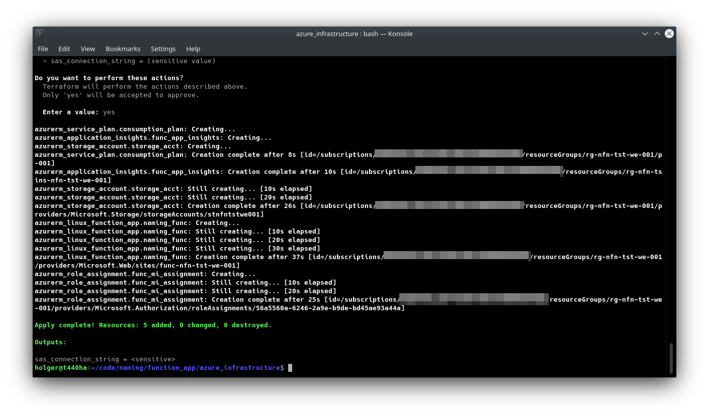
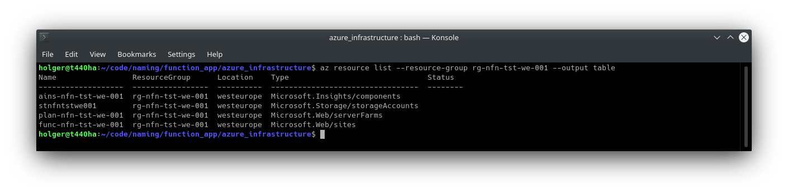
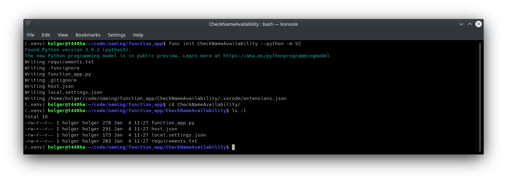
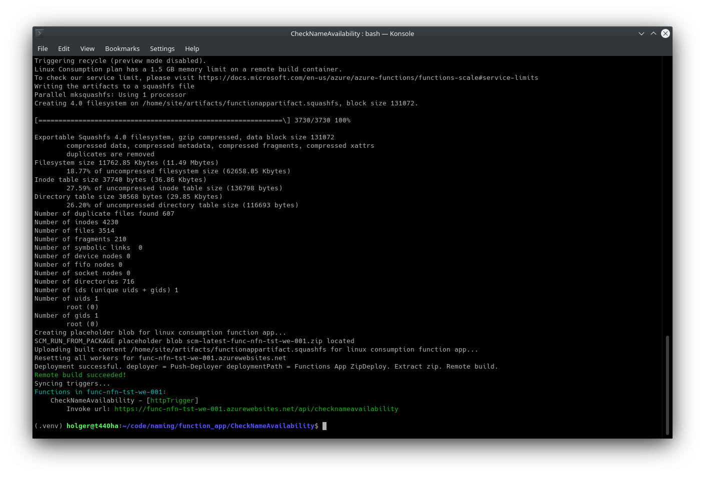

## name-func

Azure Function for checking available names across Azure Resources. Purpose: Learn Azure Functions Basics.

## Important

This repository contains some code for testing and playing around with Python in Azure Functions. 

> The code in this repository must not be used in production environments since it is lacking important functionality such as security settings, logging, error handling and more. It is only intended for testing and learning.

Resources should be removed right away after testing in order to avoid costs.

Also, the code is leveraging the [Python v2 programming model in Azure Functions](https://learn.microsoft.com/en-us/azure/azure-functions/functions-reference-python?tabs=asgi%2Capplication-level&pivots=python-mode-decorators), **which is currently in preview** [1].

## What is this?

The Azure Function will contain a modified version of the [Python script described here](https://github.com/holgerjs/az-sdk-py-samples/blob/main/py-query-available-resource-names.md) [5]. The script uses the [Azure Resource Graph](https://learn.microsoft.com/en-us/azure/governance/resource-graph/overview) to find resources with a given name across all subscriptions in scope of the principal that is running the script [6]. As we are going to use an Azure Function to run this script, we will be leveraging a [Managed Identity](https://learn.microsoft.com/en-us/azure/active-directory/managed-identities-azure-resources/overview) that holds the corresponding `Reader` role against a certain scope [7].

## Building the Azure Infrastructure

We are using [terraform and the corresponding azurerm provider](https://registry.terraform.io/providers/hashicorp/azurerm/3.37.0) to build the Azure infrastructure for the Azure Function App [2]. The terraform code is located in the [terraform folder](terraform/).

See the [Terraform documentation if you need details on how to install it](https://developer.hashicorp.com/terraform/tutorials/aws-get-started/install-cli) on the system of your choice [9].

Resources required:

* Storage Account
* App Service Plan
* Function App
* App Insights

### Terraform Code

#### Terraform Provider

File: [provider.tf](terraform/provider.tf)

As for the provider block, only the `azurerm` provider is required.
  
```terraform
terraform {
  required_providers {
    azurerm = {
      source = "hashicorp/azurerm"
    }
  }
}

provider "azurerm" {
  features {}
}
```

#### Resource Group

File [resource_group.tf](terraform/resource_group.tf)

We will use the `West Europe` region in this example - however, this can be amended to whatever region suits best. Subsequently created resources will simply refer to the resource group region in order to make sure that the same region is used for all resources.

```terraform
resource "azurerm_resource_group" "rg" {
  location = "westeurope"
  name     = "{resource-group-name}"
  tags = {
    owner       = "me"
    environment = "test"
  }
}
```

#### Storage Account

Files: 
* [storage_account.tf](terraform/storage_account.tf)
* [output.tf](terraform/output.tf)

Azure Functions require a storage account since they rely on Azure Storage for operations such as managing triggers and logging function executions. See [Storage considerations for Azure Functions](https://learn.microsoft.com/en-us/azure/azure-functions/storage-considerations?tabs=azure-cli) if more details are required around this topic [3].

```terraform
resource "azurerm_storage_account" "storage_acct" {
  name                = "{storage-account-name}"
  resource_group_name = azurerm_resource_group.rg.name
  location            = azurerm_resource_group.rg.location

  account_kind             = "StorageV2"
  account_tier             = "Standard"
  account_replication_type = "LRS"
  access_tier              = "Hot"

  min_tls_version           = "TLS1_2"
  enable_https_traffic_only = true

  tags = {
    owner       = "me"
    environment = "test"
  }
}
```

Since I wanted to check the primary access key when required for troubleshooting, I've added it as an output, however, this is not required. If added, it should be marked as `sensitive = true` for obvious reasons.

```terraform
output "sas_connection_string" {
  sensitive = true
  value     = azurerm_storage_account.storage_acct.primary_connection_string
}
```

If we want to put it out to the console, we can use this this terraform command to do so (after it has been deployed successfully):

```bash
terraform output sas_connection_string
```

#### Application Insights

File: [app_insights.tf](terraform/app_insights.tf)

For logging purposes we are also deploying App Insights, which will allow us to [monitor executions in Azure Functions](https://learn.microsoft.com/en-us/azure/azure-functions/functions-monitoring) [4]. This will be helpful for troubleshooting.

```terraform
resource "azurerm_application_insights" "func_app_insights" {
  name                = "{app-insights-name}"
  location            = azurerm_resource_group.rg.location
  resource_group_name = azurerm_resource_group.rg.name
  application_type    = "other"
}
```

#### Function App (and App Service Plan)

Files: 
* [function_app.tf](terraform/function_app.tf)
* [role_assignment.tf](terraform/role_assignment.tf)

Since we are running Python Code, the App Service Plan must be of `os_type = "Linux"`. Furthermore, in this example we're deploying it in a [Consumption Plan](https://learn.microsoft.com/en-us/azure/azure-functions/consumption-plan) [8]. This means it is in the `Dynamic` tier and we therefore need to use the `sku_name = "Y1"` configuration in terraform.

As we are using the aforementioned [Python v2 programming model in Azure Functions](https://learn.microsoft.com/en-us/azure/azure-functions/functions-reference-python?tabs=asgi%2Capplication-level&pivots=python-mode-decorators), it is important that we add `AzureWebJobsFeatureFlags = "EnableWorkerIndexing"` to the `app_settings` section. Additionally, we need `ENABLE_ORYX_BUILD = true` and `SCM_DO_BUILD_DURING_DEPLOYMENT = true` - otherwise we won't be able to use the [Remote build](https://learn.microsoft.com/en-us/azure/azure-functions/functions-deployment-technologies#remote-build) feature [10].

```terraform
resource "azurerm_service_plan" "consumption_plan" {
  name                = "{service-plan-name}"
  location            = azurerm_resource_group.rg.location
  resource_group_name = azurerm_resource_group.rg.name
  os_type             = "Linux"
  sku_name            = "Y1"
}

resource "azurerm_linux_function_app" "naming_func" {
  name                       = "{function-app-name}"
  location                   = azurerm_resource_group.rg.location
  resource_group_name        = azurerm_resource_group.rg.name
  service_plan_id            = azurerm_service_plan.consumption_plan.id
  storage_account_name       = azurerm_storage_account.storage_acct.name
  storage_account_access_key = azurerm_storage_account.storage_acct.primary_access_key

  identity {
    type = "SystemAssigned"
  }

  app_settings = {
    ENABLE_ORYX_BUILD              = true
    SCM_DO_BUILD_DURING_DEPLOYMENT = true
    AzureWebJobsFeatureFlags       = "EnableWorkerIndexing"
    APPINSIGHTS_INSTRUMENTATIONKEY = azurerm_application_insights.func_app_insights.instrumentation_key
  }

  site_config {
    application_stack {
      python_version = "3.9"
    }
  }
}
```

Lastly, it is required to assign the Function Apps' Managed Identity to a scope. For testing, I'm adding it as a reader role to the resource group scope, however, if we wanted to check for available names across multiple subscriptions, it must be added to the corresponding subscription or management group scopes.

```terraform
resource "azurerm_role_assignment" "func_mi_assignment" {
  scope                = azurerm_resource_group.rg.id
  role_definition_name = "Reader"
  principal_id         = azurerm_linux_function_app.naming_func.identity[0].principal_id
}
```

#### Deployment

We can now run `terraform init`, `terraform plan` and `terraform deploy`. If all went well, we would have terraform confirm the successful deployment.



Using the Azure CLI, we can also confirm that the resources exist as expected.

```azurecli
az resource list --resource-group {resource-group-name} --output table
```



## Creating the Function App

### Modifying the Code

File: [function_app.py](code/function_app.py)

First of all, we need to make sure that the [original Python script](https://github.com/holgerjs/az-sdk-py-samples/blob/main/py-query-available-resource-names.md) would be able to run within the Azure Function as there are a few things that are different now.

#### Managed Identity

When running the script locally, we were simply using AzureCliCredential class from the `azure.identity` library, which would use the context of the user that is locally logged on through the Azure CLI. Obviously, this won't work with a managed identity. Fortunately, this part can be easily replaced through a different class from the same library: the [DefaultAzureCredential Class](https://learn.microsoft.com/en-us/python/api/azure-identity/azure.identity.defaultazurecredential?view=azure-python) [11].

We would therefore import the following libraries:

```python
from azure.identity import DefaultAzureCredential
from azure.mgmt.resource import SubscriptionClient
import azure.mgmt.resourcegraph as arg
import json

import azure.functions as func
```

`import azure.functions as func` is required for classes specific to Function Apps and we are also adding `import json` as we want to return json values to the caller of the Function App.

We can then just add the authentication part like this and as we were using the `credential` variable already in the original code, nothign else needs to change from an authentication perspective.

```python
# Authenticate
credential = DefaultAzureCredential()
```

#### Python Function Declaration

In the original script, the code was wrapped around these two functions, which can remain unchanged:

```python
def resource_graph_query( query ):
    # Get your credentials from Azure CLI (development only!) and get your subscription list
    subs_client = SubscriptionClient(credential)
    subscriptions_dict = []
    
    for subscription in subs_client.subscriptions.list():
        subscriptions_dict.append(subscription.as_dict())
    
    subscription_ids_dict = []
    
    for subscription in subscriptions_dict:
        subscription_ids_dict.append(subscription.get('subscription_id'))

    # Create Azure Resource Graph client and set options
    resource_graph_client = arg.ResourceGraphClient(credential)
    resource_graph_query_options = arg.models.QueryRequestOptions(result_format="objectArray")

    # Create query
    resource_graph_query = arg.models.QueryRequest(subscriptions=subscription_ids_dict, query=query, options=resource_graph_query_options)

    # Run query
    resource_graph_query_results = resource_graph_client.resources(resource_graph_query)

    # Show Python object
    return resource_graph_query_results

def check_name_availability(resource_name, resource_type=None):
    
    if(resource_type):
        rg_query = f"Resources | where name =~ '{resource_name}' | where type =~ '{resource_type}'"
    else:
        rg_query = f"Resources | where name =~ '{resource_name}'"
    
    
    rg_results = resource_graph_query(rg_query)
    
    results_dict = []

    if(rg_results.data):
        availability = False
    else:
        availability = True

    results_dict = dict({
        'resource_name': resource_name,
        'available': availability
    })
    
    return results_dict
```

#### Code specific to the Function App

The following code had to be modified to suit the Function App. 
We are basicall defining the name and the route:

```python
app = func.FunctionApp()

@app.function_name(name="CheckNameAvailability")
@app.route(route="checkNameAvailability")
```

This will create the Function App with a name of `CheckNameAvailability` and the route, which defines the URL - in the case of above example this is `https://{function-app-name}.azurewebsites.net/api/checknameavailability`.

Lastly, we need the main function containing the code. The function accepts two parameters, `resourceName` and `resourceType`, which are added to the corresponding variables `r_name` and `r_type`. These can be passed as parameters or json payload. Then we do check whether only `resourceName` or bothm `resourceName` and `resourceType`, or none of these are populated and return the corresponding result to the caller.

```python
def main(req: func.HttpRequest) -> func.HttpResponse:
    r_name = req.params.get('resourceName')
    r_type = req.params.get('resourceType')
    if not r_name:
        try:
            req_body = req.get_json()
        except ValueError:
            pass
        else:
            r_name = req_body.get('resourceName')
    
    if not r_type:
        try:
            req_body = req.get_json()
        except ValueError:
            pass
        else:
            r_type = req_body.get('resourceType')

    if r_name and r_type:
        result = check_name_availability(resource_name=r_name, resource_type=r_type)
        result_as_json = json.dumps(result)
        return func.HttpResponse(result_as_json)
    elif r_name:
        result = check_name_availability(resource_name=r_name)
        result_as_json = json.dumps(result)
        return func.HttpResponse(result_as_json)
    else:
        return func.HttpResponse(
            "This HTTP triggered function executed successfully. Pass a resourceName in the query string or in the request body for a proper response.",
            status_code=200
        ) 
```


### Creating the Function Locally

For creating the function locally, we need to make sure the [appropriate prerequisites are met](https://learn.microsoft.com/en-us/azure/azure-functions/create-first-function-cli-python?pivots=python-mode-decorators&tabs=azure-cli%2Cbash#prerequisite-check) [12].
We can then following along with the [Azure Function documentation on creating a local function project](https://learn.microsoft.com/en-us/azure/azure-functions/create-first-function-cli-python?pivots=python-mode-decorators&tabs=azure-cli%2Cbash#create-a-local-function-project) [13].

```bash
func init CheckNameAvailability --python -m V2
```

This will create a new folder along with files required for the Function App.



### Add the Code

Files:
* [function_app.py](code/function_app.py)
* [requirements.txt](code/requirements.txt)

We can then add the previously created code into the `function_app.py` file. Furthermore, the requirements.txt needs to be populated since we are using the remote build feature. A sample can be found in the [code](code/) folder, that includes the following:

```python
# Do not include azure-functions-worker in this file
# The Python Worker is managed by the Azure Functions platform
# Manually managing azure-functions-worker may cause unexpected issues

azure-functions
azure-common
azure-core
azure-identity
azure-mgmt-core
azure-mgmt-resource
azure-mgmt-resourcegraph
certifi
cffi
charset-normalizer
cryptography
idna
isodate
msal
msal-extensions
msrest
oauthlib
portalocker
pycparser
PyJWT
requests
requests-oauthlib
six
typing-extensions
urllib3
```

### Publishing the Function

For publishing the code to our Azure Function App, we can run the following command in order to trigger the remote build:

```bash
func azure functionapp publish {function-app-name}
```

After some time, we should see the notification `Remote build succeeded!` and the `Syncing triggers...` is successfully displaying the new function URL. If this is running into a timeout, then there might be missing dependencies in the requirements.txt or another issue with the code.



### Testing the Functionality

In order to test the Function App, we would need to know the Function Key. We could either look it up through the portal or use the command line:

```bash
func azure functionapp list-functions {function-app-name} --show-keys
```

Also from the command line, we can use `curl` to test the newly created function:

```bash
curl -X POST https://{function-app-name}.azurewebsites.net/api/checknameavailability \
     -H 'Content-Type: application/json' \
     -H 'x-functions-key: {FUNCTION-KEY}' \
     -d '{"resourceName": "{storage-account-name}", "resourceType": "Microsoft.Storage/storageAccounts"}' | jq
```

In the case of above example, the result should be false, since I used the same name for the Function Apps Storage Account.

```json
{
  "resource_name": "{storage-account-name}",
  "available": false
}
```

If we tried with a different name, it should return `true`:

```bash
curl -X POST https://{function-app-name}.azurewebsites.net/api/checknameavailability \
     -H 'Content-Type: application/json' \
     -H 'x-functions-key: {FUNCTION-KEY}' \
     -d '{"resourceName": "{unused-storage-account-name}", "resourceType": "Microsoft.Storage/storageAccounts"}' | jq
```

```json
{
  "resource_name": "{unused-storage-account-name}",
  "available": true
}
```

## Cleaning Up

After successful learning and testing, we can clean everything up by running `terraform destroy` and remove the previously created resources.

## References

|  # | Title | URL | Accessed-On |
| --- | --- | --- | --- |
| 1 | Azure Functions Python developer guide | https://learn.microsoft.com/en-us/azure/azure-functions/functions-reference-python |  2023-01-04 |
| 2 | Terraform: azurerm | https://registry.terraform.io/providers/hashicorp/azurerm/3.37.0 | 2023-01-04 |
| 3 | Storage considerations for Azure Functions | https://learn.microsoft.com/en-us/azure/azure-functions/storage-considerations | 2023-01-04 |
| 4 | Monitor executions in Azure Functions | https://learn.microsoft.com/en-us/azure/azure-functions/functions-monitoring | 2023-01-04 |
| 5 | Azure SDK for Python - How to check for Available Resource Names | https://github.com/holgerjs/az-sdk-py-samples/blob/main/py-query-available-resource-names.md | 2023-01-04 |
| 6 | What is Azure Resource Graph? | https://learn.microsoft.com/en-us/azure/governance/resource-graph/overview | 2023-01-04 |
| 7 | What are managed identities for Azure resources? | https://learn.microsoft.com/en-us/azure/active-directory/managed-identities-azure-resources/overview | 2023-01-04 |
| 8 | Azure Functions Consumption plan hosting | https://learn.microsoft.com/en-us/azure/azure-functions/consumption-plan | 2023-01-04 |
| 9 | Install Terraform | https://developer.hashicorp.com/terraform/tutorials/aws-get-started/install-cli | 2023-01-04 |
| 10 | Azure Functions - Remote build | https://learn.microsoft.com/en-us/azure/azure-functions/functions-deployment-technologies#remote-build | 2023-01-04 |
| 11 | DefaultAzureCredential Class | https://learn.microsoft.com/en-us/python/api/azure-identity/azure.identity.defaultazurecredential | 2023-01-04 |
| 12 | Quickstart: Create a Python function in Azure from the command line - Prerequisite check | https://learn.microsoft.com/en-us/azure/azure-functions/create-first-function-cli-python?pivots=python-mode-decorators&tabs=azure-cli%2Cbash#prerequisite-check | 2023-01-04 |
| 13 | Quickstart: Create a Python function in Azure from the command line - Create a local function project | https://learn.microsoft.com/en-us/azure/azure-functions/create-first-function-cli-python?pivots=python-mode-decorators&tabs=azure-cli%2Cbash#create-a-local-function-project | 2023-01-04 |
